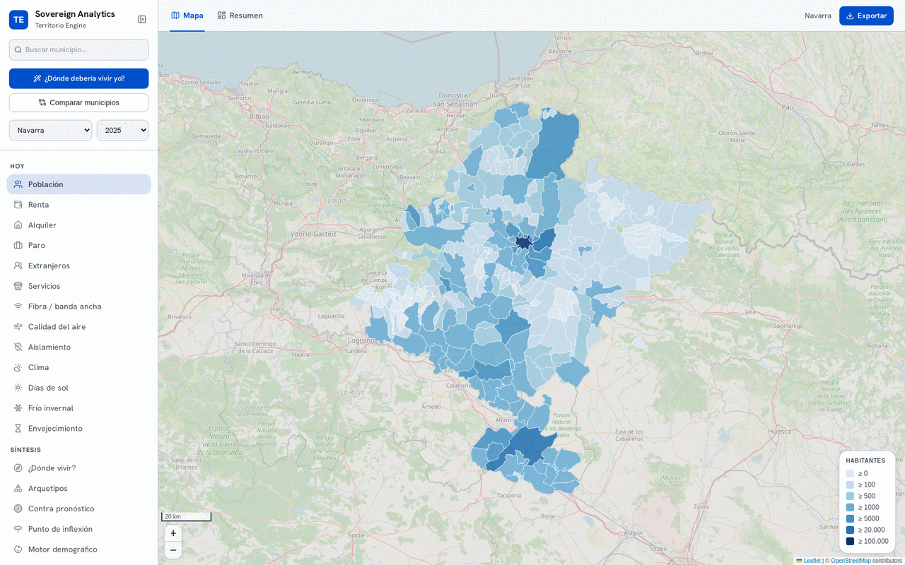
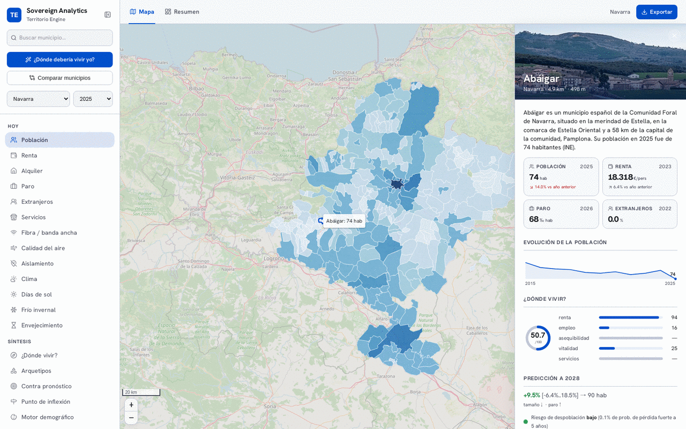
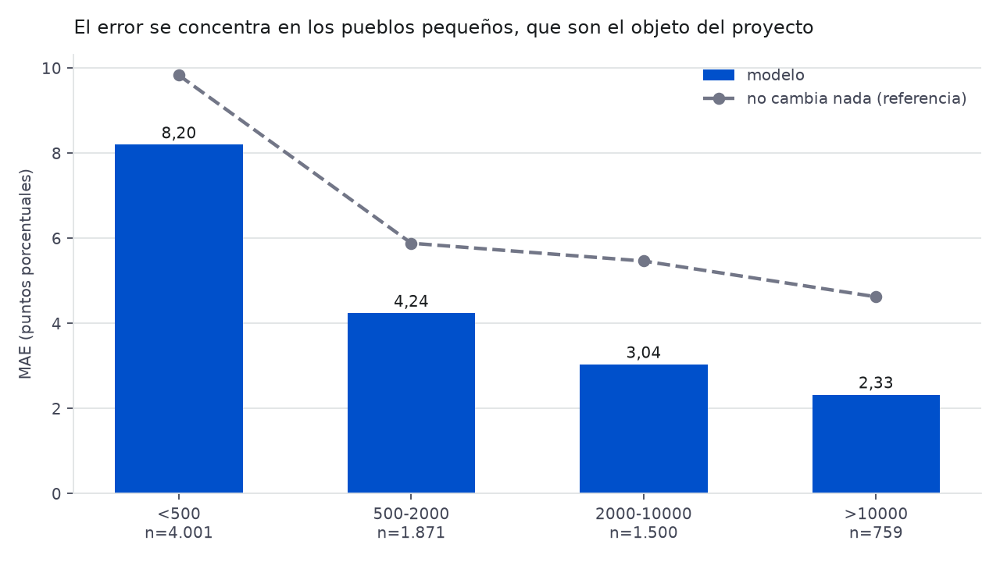
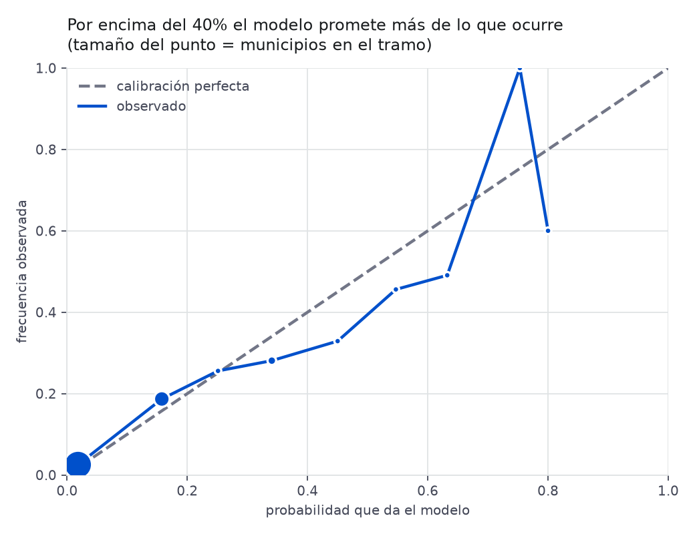
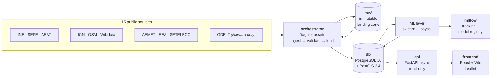

# territorio-engine

[](https://github.com/igoikofanega/territorio-engine/actions/workflows/ci.yml)
[](LICENSE)
[](https://www.python.org/)
[](https://github.com/astral-sh/ruff)
[](https://postgis.net/)

**A data-fusion engine for Spanish municipalities.** It ingests heterogeneous public
datasets, harmonises them onto a single key — **`municipality × year`** — and answers one
question with machine learning:

> *Which way is this village heading — growing, or emptying out?*

Spain's rural depopulation ("la España vaciada") is measured by a dozen agencies that
publish in a dozen incompatible formats. This project does the unglamorous work of making
those sources agree with each other, and then builds honest models on top.

**8,217 municipalities · 96,585 fact rows · 15 public sources · 2015→**

> **A note on language.** This README is in English; the code, column names, docs and
> commit messages are in Spanish. That is deliberate, not an accident — see
> [Why bilingual](#why-bilingual).

---

## What it does

Three products sit on the same harmonised matrix:

| | |
|---|---|
| **A map with 24 layers** | Population, income, unemployment, rent, foreign-born residents, broadband, air quality, isolation, climate — plus synthesised layers: composite index, archetypes, LISA hot spots, inflection points, risk. |
| **A per-municipality dossier** | Everything known about one town in one panel: population history, 5-year forecast with uncertainty band, depopulation risk, what drives it, whether it is beating or missing its own forecast, and its nearest statistical twins. |
| **A personal recommender** | *"Where should I live?"* — hard filters plus adjustable weights over the composite index, ranked nationally. The weights are a **choice, not a truth**, so the UI exposes them. |



The per-municipality dossier — here Abáigar, Navarra, population 74. Note the forecast band
`[-6.4% .. 18.5%]`: for a village this small, that width is the honest answer.



The caveats are a tab, not a footnote. Error by municipality size, spatial autocorrelation
of the residuals, the traffic light's calibration failure, which layers are regional, and
every source with its licence — all in the product, not only in this README.


---

## ML approach

The flagship model predicts the **percentage change in population over 5 years** for each
municipality, from 17 features spanning demography, economy, housing, climate, connectivity
and isolation.

What matters here is not the algorithm — it is a `HistGradientBoostingRegressor` — but the
**evaluation discipline**:

> Every number below is generated by `make evaluar` and committed to
> [`docs/evaluacion/`](docs/evaluacion/informe.md), so it can be checked without running
> anything. It used to be copied from MLflow by hand.

**Rolling-origin backtest, not a single split.** One fold per validation base year, always
training on the past only. A single cut gives a number with no dispersion, which reads as
more precise than it is:

| Model | MAE (percentage points) | R² |
|---|---|---|
| Persistence (assume no change) | 7.65 | — |
| Trend (extrapolate recent growth) | 10.02 | — |
| **HistGradientBoosting** | **5.80 ± 0.23** | **0.35** |

The model beats persistence by 24% and naive trend extrapolation by 42%. Note that
extrapolating the trend is *worse* than assuming nothing changes — a useful reminder about
small-population noise.

Base years are **derived from actual data coverage**, not hardcoded, so the window moves on
its own as new data lands. That is less trivial than it sounds: `max(year)` is the wrong
answer, because the matrix already contains half-loaded years — 2026 currently holds 7,030
unemployment rows and zero population rows, since the year's SEPE file is published long
before the Padrón. Taking it as "the latest year" would silently produce an empty dataset.

**A leak was found and the numbers went down.** Until 2026-09 this table read 5.79 / 0.34.
That model read `pct_extranjeros` with `ORDER BY anio DESC` — the *most recent* value — and
applied it to every base year including training ones, although the table holds a yearly
series. Measured on the real database, that inflated the feature's correlation with the
2015→2020 target from 0.159 (contemporaneous) to 0.275. Fixing it cost 0.19 pp of MAE, and
the honest number is the one published now.

**Overlapping windows are priced, not hidden.** The target looks 5 years ahead, so with
contiguous folds the training and validation windows share trajectory over the same
municipalities. With a 2-year embargo the MAE rises to 6.33. A full embargo (= the horizon)
is **not feasible**: population data starts in 2015 and there are not enough base years
left. That is a limit of the data, and it is stated rather than quietly skipped.

**The headline average hides where it hurts.** The whole point of the project is small
villages, and that is exactly where the model is weakest:



| Size | n | MAE | If nothing changed |
|---|---|---|---|
| <500 | 4,001 | **8.53** | 9.83 |
| 500-2,000 | 1,871 | 4.24 | 5.88 |
| 2,000-10,000 | 1,500 | 3.07 | 5.47 |
| >10,000 | 759 | **2.36** | 4.63 |

A factor of 3.6 between the extremes. The model still wins in every stratum, but by much
less than the aggregate suggests.

**The residuals are spatially autocorrelated.** Moran's I on the error = **0.114**
(p = 0.001, 8 nearest neighbours by centroid). Neighbouring municipalities fail in the same
direction, so there is geography the 17 features do not capture — expected, since
depopulation is a regional phenomenon, and the clearest direction for improvement.

**Uncertainty is shown, not hidden.** Two extra quantile models (q10, q90) produce the band
displayed on every forecast. A point estimate for a village of 200 people would be dishonest
on its own.

**Calibration: a negative result, published anyway.** The depopulation risk classifier —
will this town lose >10% of its population in 5 years? — is calibrated with isotonic
regression. Measured on a year the calibrator never saw (train / calibrate / test are three
separate temporal blocks), it **does not improve** the Brier score: 0.0768 calibrated versus
0.0756 uncalibrated. Above 40% the model promises more than happens.



So the traffic light **ranks well but does not quantify well** — AUC 0.84 separates the
towns at risk, which is what the green/amber/red UI uses. Reading the percentage as a
literal frequency is what does not hold. An earlier version of this README claimed
"70% actually means 70%"; that claim came from calibrating and scoring on the same rows.

**The LLM layer is measured before it is used.** A separate experiment labels local-news
headlines per municipality. Before building any feature on that, its quality is measured
against a 193-headline stratified golden set: **95.1% accuracy** on "is this headline
really about this municipality", precision and recall 0.84, against a 15.4% base rate for
saying yes to everything.

That base rate is the finding. **Only 13.5% of the headlines GDELT attributes to a
municipality are actually about it** — for nine of the 25 sampled towns, *none* of the
eight sampled headlines were. "Garde" matches as a common word, "Peralta" and "Legarda" as
surnames. Disambiguation is not preprocessing here; it is half the job.

The golden set was labelled by a model (a more capable one), **not by a human**, and that
is stated wherever the number appears — it measures agreement between two models, so a
bias shared by both would be invisible.

**Explainability without overclaiming.** Permutation importance globally; per-municipality
"drivers" derived from importance × correlation sign × deviation from the median. The code
labels this an *honest heuristic, not causal* — because it is.

Everything is tracked in MLflow, with the flagship model in the Model Registry. Full report:
[`docs/evaluacion/informe.md`](docs/evaluacion/informe.md). Model card:
[`docs/model-card.md`](docs/model-card.md).

Beyond the flagship: cohort-component projection (Hamilton-Perry), K-means archetypes, local
Moran's I (LISA) hot spots, change-point detection on population series, out-of-sample
residuals to find towns beating their forecast, and a vegetative-vs-migratory decomposition
of population change.

---

## Architecture



Five services, all reproducible through Docker Compose.

Two rules are structural, not stylistic:

1. **Raw data is immutable.** Every ingestion lands the original file in `raw/` *before*
   transforming anything. Re-running a pipeline never re-downloads, and the provenance of
   every number is traceable to a file on disk.
2. **Spatial joins are precomputed offline.** The orchestrator is the only writer; the API
   only reads. PostGIS never computes geometry at request time.

---

## Data sources

The part nobody sees in a screenshot, and the reason the rest is possible.

| Source | Producer | What it gives | Licence |
|---|---|---|---|
| Municipal boundaries | IGN / CNIG | Geometry, area | CC BY 4.0 |
| Padrón | INE (29005) | Population by sex | Free w/ attribution |
| Population pyramid | INE | Age cohorts (52-province loop) | Free w/ attribution |
| Vital statistics | INE (1470/1482) | Birth/death rates (provincial) | Free w/ attribution |
| Income atlas | INE / AEAT | Net income per person | Free w/ attribution |
| Registered unemployment | SEPE | Annual mean | Free w/ attribution |
| Reference rents | MIVAU (SERPAVI) | €/m² per month | Free w/ attribution |
| Climate | AEMET OpenData | Temperature, rain, clear days, humidity | AEMET terms |
| Foreign-born population | INE (33571) | Count and % | Free w/ attribution |
| Broadband coverage | SETELECO | FTTH, ≥100 Mbps, 5G | Free w/ attribution |
| Air quality | EEA | PM2.5, NO₂, PM10, O₃ (1 km rasters) | EEA reuse policy |
| Points of interest | OpenStreetMap | Health, education, retail | **ODbL (share-alike)** |
| Municipal facts | Wikidata | Altitude, coat of arms, website | CC0 |
| Descriptions | Wikipedia (ES) | Text and images | **CC BY-SA (share-alike)** |
| News metadata | GDELT DOC 2.0 | Headline, date, outlet, URL — **Navarra only**, 2017→ | GDELT terms |

Apache-2.0 covers **the code**. The datasets keep their own licences — see [`NOTICE`](NOTICE),
which flags the two share-alike ones explicitly. No data is redistributed in this repository;
`raw/` is git-ignored and everything is fetched at run time.

---

## Quickstart

Requires Docker and Docker Compose. Nothing else.

```bash
cp .env.example .env
make up
```

| Service | URL |
|---|---|
| API (OpenAPI docs) | http://localhost:8000/docs |
| Dagster UI | http://localhost:3010 |
| MLflow | http://localhost:5055 |
| Frontend | http://localhost:5173 |

Ports are configurable in `.env`; they only affect the host side, since services talk to
each other over the internal Docker network.

### Loading data

The stack starts empty. **Order matters** — geometry first, then facts, then models:

```bash
make migrate              # create the schema (28 Alembic revisions)
make ingest-municipios    # IGN geometry  → dim_municipio
make ingest-padron        # INE Padrón    → population
make ingest-piramide      # INE pyramid   → age cohorts
make ingest-mnp           # INE vitals    → provincial rates
make ingest-paro          # SEPE          → unemployment
make ingest-renta         # INE/AEAT      → income
```

Then the optional sources (`ingest-alquiler`, `ingest-clima`, `ingest-nacionalidad`,
`ingest-fibra`, `ingest-aire`, `ingest-servicios`, `ingest-wikidata`, `ingest-wikipedia`,
`ingest-aislamiento`, `ingest-noticias`), and finally the models:

```bash
make indice          # composite "where to live" index
make entrenar-ml     # train + backtest + forecast (logs to MLflow)
make riesgo          # calibrated depopulation risk
make arquetipos      # K-means archetypes
make proyectar       # cohort-component projection
```

`make help` lists every target. Two caveats worth knowing before you start: `ingest-clima`
takes ~40 minutes because AEMET's API is rate-limited to one station every 3 seconds and
requires a free API key in `.env`; `ingest-aire` downloads four 75 MB GeoTIFF rasters.

---

## Development

```bash
make check        # everything CI checks, locally
make lint         # ruff (pinned version)
make typecheck    # mypy
make test         # pytest, both services
make front-check  # tsc + eslint + vitest
make hooks        # install pre-commit (once)
```

Two targets check the **data** rather than the code, which the test suite cannot do
because it runs without a database:

```bash
make comprobar    # Dagster asset checks over the matrix
make evaluar      # regenerate docs/evaluacion/ from the current database
```

Node is **not** required on the host — the frontend targets run in a throwaway container
with your UID, so nothing lands in the repo owned by root.

**Rebuilds are per-service.** After changing code, restarting is not enough:

```bash
docker compose up --build -d api
```

Tests must pass **without network access and without API keys**; anything external is
exercised through recorded fixtures. That is what keeps this reproducible for someone who
just cloned it.

CI runs lint, mypy, tests with coverage (with a threshold that fails the build, not just a
report), the full frontend pipeline, a schema-drift check against a real PostGIS instance,
a Docker build of all five services, and publishes multi-arch images (amd64 + arm64) to
GHCR on `main`.

**What the tests actually defend.** Three of them exist because the corresponding failure
happened, silently, and passed CI green:

- `test_features.py` — no feature of base year T may come from a year after T.
- `test_ml_humo.py` — the model must beat the persistence baseline, not merely produce
  finite metrics.
- `test_loaders.py` — every UPSERT must refresh every column it inserts, or re-ingesting
  leaves stale data without ever failing.

The data checks live outside the test suite, in `comprobaciones.py`, because they need a
populated database: 5-digit municipality codes, key uniqueness, plausible population, and
no year loaded halfway.

**Current status and roadmap**: [`docs/ESTADO.md`](docs/ESTADO.md) (in Spanish) tracks what
is done, what is next, and the known debt.

---

## Project structure

```
├── db/init/            # PostGIS extensions, run once on volume creation
├── docs/               # architecture, matrix spec, ADRs, design system
├── raw/                # immutable landing zone (git-ignored)
├── services/
│   ├── api/            # FastAPI, read-only
│   │   └── src/territorio_api/
│   │       ├── capas.py        # declarative layer registry + endpoint factory
│   │       └── routers/        # endpoints grouped by domain
│   ├── orchestrator/   # Dagster + Alembic + ML — the only writer
│   │   ├── migrations/         # 29 revisions
│   │   └── src/territorio_pipelines/
│   │       ├── sources/        # 15 source adapters
│   │       └── ml/             # models, features, spatial statistics
│   └── mlflow/         # tracking server
└── frontend/           # React + TypeScript + Vite + Leaflet
    └── src/escalas.ts  # the product catalogue: 24 map modes
```

Adding a map layer is one entry in `capas.py` (server) and one in `escalas.ts` (client), not
a copied endpoint — see [`CONTRIBUTING.md`](CONTRIBUTING.md).

---

## Limitations and honesty

Stated plainly, because a model of rural decline that oversells itself is worse than none.

- **Vital rates are provincial, not municipal.** INE does not publish births and deaths per
  municipality in this series, so the vegetative/migratory decomposition applies provincial
  rates to municipal populations. It is an **estimate, not a measurement**, and small towns
  are where that approximation hurts most.
- **Correlation, not causation.** The per-municipality "drivers" are a ranking heuristic to
  guide investigation. Nothing here identifies a causal effect.
- **Small populations are noisy — and now measured.** MAE is 8.53 pp for municipalities
  under 500 inhabitants versus 2.36 for those over 10,000. The aggregate 5.80 is an average
  over a very uneven surface, and the weak half is the half this project exists for.
- **The residuals are spatially autocorrelated** (Moran's I = 0.114, p = 0.001), so the
  model is missing regional structure. Known, measured, unfixed.
- **The risk percentage is not a calibrated frequency.** Isotonic calibration does not
  improve the Brier score out of sample. Use the green/amber/red level, not the number.
- **Fibre coverage is a snapshot applied to every base year**, because the source publishes
  no history. It is a declared leakage risk that the available data cannot remove.
- **No municipal lineage tracking.** `dim_municipio` is not yet slowly-changing; municipal
  mergers and splits break series continuity. Tracked as known debt.
- **Data quality flags are missing.** Statistical secrecy, imputation and masking are not yet
  flagged per cell, even though the project's own principles demand it. This is the debt most
  at odds with its stated values, and it is an open issue rather than a hidden one.
- **Forecast horizon is 5 years.** Beyond that, the honest answer is that nobody knows.

---

## Why bilingual

The code, column names and documentation are in Spanish; this README is in English.

The data is Spanish and its vocabulary has no clean English equivalent — `cod_municipio`,
`renta_neta_media_persona`, `padrón`, `paro registrado`. Translating it would insert a lossy
mapping layer between the code and the official sources it mirrors, and would make every bug
report harder to trace back to INE's own field names. The README is in English because the
audience for *"what is this and why"* is wider than the audience for the schema.

---

## Licence

Code under [Apache-2.0](LICENSE). Data belongs to its producers under the licences listed in
[`NOTICE`](NOTICE) — including two share-alike ones that carry obligations if you
redistribute derived datasets.

Built as a public-interest / civic-tech project.
