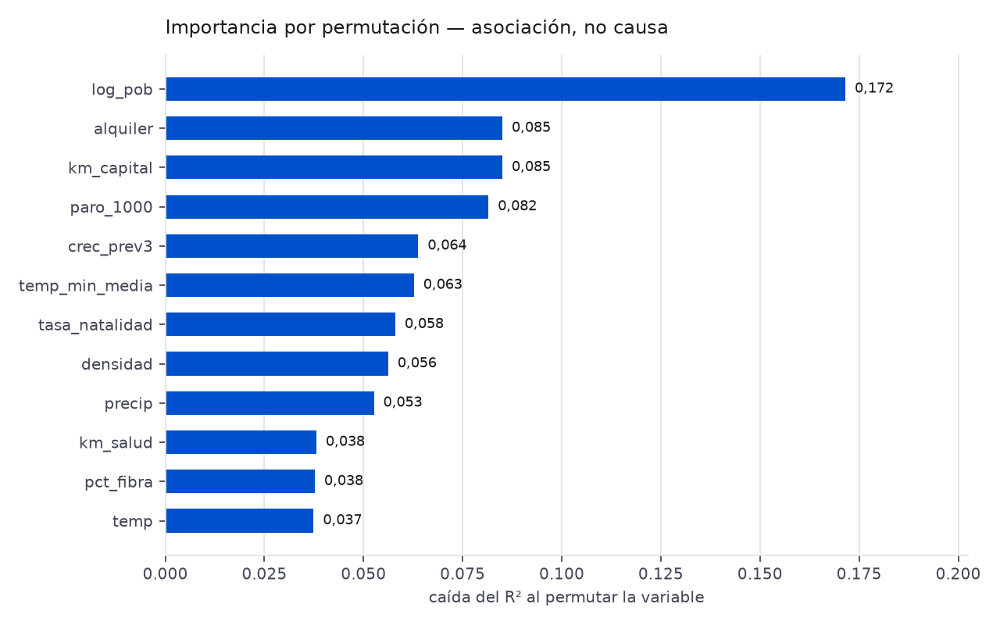

# Informe de evaluación

> **Generado por `make evaluar`.** No editar a mano: se regenera desde la base de datos.
> Las cifras de este fichero son las que debe citar el README.

Horizonte de predicción: **5 años**. Target: variación porcentual de
población entre el año base T y T+5.

## 1. Backtest de origen rodante

Un pliegue por año base de validación, entrenando siempre solo con años anteriores.
Un corte único da una cifra sin dispersión que parece más precisa de lo que es.

| Año de validación | Entrena con | n val | MAE | R² | MAE persistencia | MAE tendencia |
|---|---|---|---|---|---|---|
| 2019 | 2015-2018 | 8.131 | 5,547 | 0,406 | 7,662 | 10,192 |
| 2020 | 2015-2019 | 8.131 | 5,940 | 0,309 | 7,632 | 9,844 |

**MAE = 5,744 ± 0,278 pp** (2 pliegues,
rango 5,547–5,940).

Pliegues descartados y por qué:

- 2016: sin dato en entrenamiento para crec_prev3
- 2017: sin dato en entrenamiento para crec_prev3
- 2018: sin dato en entrenamiento para crec_prev3

### El coste del solape

El target mira 5 años adelante, así que con pliegues contiguos las ventanas
de train y validación comparten trayectoria sobre los mismos municipios. Separarlas exige
un embargo, y la ventana de datos disponible no da para mucho:

| Embargo (años) | Pliegues | MAE medio | Nota |
|---|---|---|---|
| 2 | 1 | 6,157 |  |
| 3 | 0 | — | sin pliegues con datos suficientes |
| 4 | 0 | — | sin pliegues con datos suficientes |
| 5 | 0 | — | sin pliegues con datos suficientes |

Con embargo 1 el MAE es 5,744; con embargo 2, 6,157. La diferencia
es el precio de haber estado midiendo sobre ventanas solapadas. **Un embargo completo
(= el horizonte) no es factible hoy**: la población empieza en 2015 y no quedan años base
suficientes. Es una limitación de los datos, no una decisión de diseño, y se declara en
vez de publicar el número más favorable.

## 2. Dónde falla el modelo

| Tamaño | n | MAE | Sesgo | MAE si no cambia nada |
|---|---|---|---|---|
| <500 | 4.001 | 8,51 | -0,31 | 9,83 |
| 500-2000 | 1.871 | 4,24 | +1,16 | 5,88 |
| 2000-10000 | 1.500 | 3,04 | +0,30 | 5,47 |
| >10000 | 759 | 2,33 | -0,17 | 4,63 |

Esto es lo que un MAE agregado esconde: el error en los municipios de menos de 500
habitantes es **3,7 veces**
el de los de más de 10.000. Y son justo los municipios por los que existe este proyecto.
La comparación honesta no es contra cero, sino contra "no cambia nada" en cada estrato:
ahí el modelo sigue ganando, pero por menos de lo que sugiere la cifra global.

### Las cinco provincias donde peor va

| Provincia | n | MAE | Sesgo |
|---|---|---|---|
| 19 | 288 | 14,48 | -1,82 |
| 42 | 183 | 10,32 | -3,75 |
| 16 | 238 | 9,73 | +1,77 |
| 26 | 174 | 9,53 | -0,73 |
| 40 | 209 | 9,45 | +2,64 |

## 3. ¿Le sobra estructura espacial al residuo?

Moran's I sobre el error del pliegue más reciente, con 8 vecinos más
próximos por centroide:

- **I = 0,1038** (esperado bajo azar: -0,0001), p = 0,001, n = 8.131

El error **no** está repartido al azar en el mapa: municipios vecinos fallan en el mismo
sentido. Queda geografía que las 17 features no capturan. Es un
resultado esperable —la despoblación es un fenómeno regional, no municipal— y marca la
dirección de mejora más clara: una feature de contexto comarcal, o un término espacial
explícito.

## 4. Qué mueve la predicción

Importancia por permutación sobre el pliegue más reciente. Mide **asociación, no causa**:
que `crec_prev3` pese mucho no significa que la tendencia cause el futuro, sino que
resume información que las demás variables no traen.

## 5. Calibración del semáforo de despoblación

Evento: perder más del 10 % de la población en 5 años.
Partición de tres tramos, todos temporales: se entrena con 2015-2018,
se calibra con 2019 y se mide con **2020**, que el calibrador
no ha visto.

| | |
|---|---|
| AUC | 0,8439 |
| Brier sin calibrar | 0,07534 |
| Brier calibrado (isotónica) | 0,07596 |
| Tasa base del evento | 0,0980 |
| n | 8.131 |

| Tramo | n | Promete | Ocurre |
|---|---|---|---|
| 0.0-0.1 | 5.355 | 0,018 | 0,025 |
| 0.1-0.2 | 1.666 | 0,158 | 0,187 |
| 0.2-0.3 | 262 | 0,251 | 0,256 |
| 0.3-0.4 | 509 | 0,341 | 0,281 |
| 0.4-0.5 | 152 | 0,450 | 0,329 |
| 0.5-0.6 | 68 | 0,547 | 0,456 |
| 0.6-0.7 | 108 | 0,632 | 0,491 |
| 0.7-0.8 | 1 | 0,753 | 1,000 |
| 0.8-0.9 | 10 | 0,800 | 0,600 |

**Resultado negativo, y se publica igual.** Medida fuera de la muestra en que se ajusta,
la calibración isotónica **no mejora** el Brier (0,07596 frente a
0,07534 sin calibrar). El diagrama enseña por qué: por encima del
40 % el modelo promete más de lo que ocurre, y los tramos altos tienen tan pocos
municipios que la isotónica no tiene con qué corregirlos.

La consecuencia práctica es que **el semáforo ordena bien pero no cuantifica bien**: el
AUC de 0,84 dice que separa los municipios en riesgo de los que no, y eso es lo
que usa la interfaz (verde / ámbar / rojo). Lo que no se sostiene es leer la probabilidad
como una frecuencia literal.
